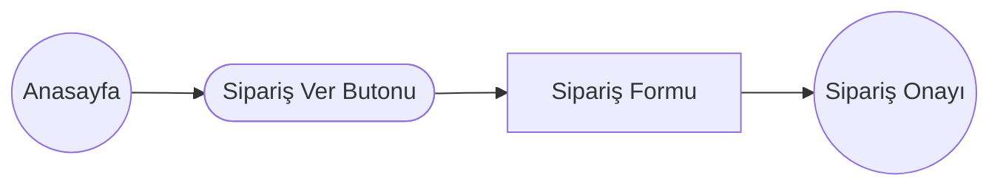
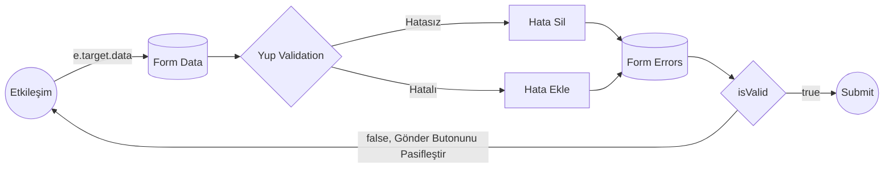

# Sprint Challenge: _Tek Sayfa Uygulamalar SPA_

SPA: Single Page Application

## Proje Açıklaması

Bu challenge, geçmiş sprint boyunca öğrenilen kavramları ve teknikleri uygulamana ve bunları somut bir projede kullanmanı sağlayacak. Bu sprintte **tek sayfa uygulamalarını** (SPA) keşfettin. Sprint boyunca, **routing, formlar, ve cypress testlerini** öğrendin. Challenge skorun, bu sprint boyunca işlenen materyali kullanarak bağımsız çalışma yapabilme yeteneğinin bir göstergesi olacak. Bu projeyi de ödevlerdeki gibi tek başına yapacaksın.
S8 içinde de Workintech eğitmenlerine, adeta bir teknik mülakttaymış gibi, bu projeyi sunmanı istiyoruz. Bu sunumda, _4 dk_ içerisinde, CSS'e döktüğün arayüzü ve de geliştirdiğin Reach JS sistemi anlatacaksın. İlk önce arayüzde nasıl bir kullanıcı deneyimi sunduğunu kısaca özetleyip, sonra altta kodların nasıl çalıştığını, nasıl bir veri akışı kurduğunu, açık bir şekilde ifade edebilmelisin.

> Kısaca: 4 dk içinde, önce arayüzü anlatıp, sonra kodun nasıl
> çalıştığını ifade edebilmelisin. Zaman kullanımı ve sunum tekniğin de değerlendirme kriterlerinde yer alıyor. Öncesinde, kendini videoya çekerek, sunum pratiği yapabilirsin.

Not\* Bu dökümanın en sonunda da, sunumda seni değerlendireceğimiz başlıkları da bulabilirsin.

### Veri Diagramları

#### Routes



#### Sipariş Formu Veri Akışı



## Talimatlar

Bu sprint challenge'ında, bilgisayar başında karnı acıkan yazılımcılara yiyecek getirmek için tasarlanmış bir web sitesi **Teknolojik Yemekler**' markasına, _Anasayfa_, _Sipariş Formu_ ve _Sipariş Alındı_ sayfası oluşturarak bu konulardaki ustalığınızı göstereceksin.  
Proje iki zorluk aşamalı,

1.  **MVP**: ilk önce asgari yeterli ürün (MVP-Minimum Viable Product) aşamasına getirmeyi hedeflemelisin.
2.  **ADV**: İleri düzey görevlere eadece ama sadece, tasarımdaki MVP kilometre taşına geldikten sonra başlamalısın. Buradaki gelişmiş görsel ve teknik problemleri çözmeyi MVP sonrasında, aşağıda belirtilen sırada çözerek ilerlemelisin.

## Zorluk 1: MVP Tasarım Öğeleri

### Görev 1: Proje Kurulumu

- [ ] Forklayarak bir kopya oluşturun
- [ ] Forku klonlayın
- [ ] Main branch üzerinde çalışın
- [ ] Comitinizi pushlayın: `git push origin main`
- `axios`
- `yup`
- `toastify`
- `tailwind`
- `cypress.io` v.b.

### Görev 2: MVP UI Tasarımı ve React JS Geliştirmeleri

Zamanı verimli kullanmak için aşağıdaki sırayla geliştirme yapmanı tavsiye ediyoruz.

1.  [Sipariş Formu](./Arayuz-Tasarimlari/Seviye-1-MVP/MVP-OrderPizza.png)
2.  [Anasayfa](./Arayuz-Tasarimlari/Seviye-1-MVP/MVP-Home.png)
3.  [Sipariş Onayı](./Arayuz-Tasarimlari/Seviye-1-MVP/MVP-Success.png)

#### Renk Kodları

Sarı #FDC913, Açık Gri: #5F5F5F, Koyu Gri #292929, Kırmızı #CE2829, Bej: #FAF7F2

#### Tasarımda Kullanılan Fontlar

[Barlow](https://fonts.google.com/specimen/Barlow)
[Quattrocento](https://fonts.google.com/specimen/Quattrocento)
[Satisfy](https://fonts.google.com/specimen/Satisfy)

### Görev 3: MVP Proje Gereklilikleri

MVP aşamasına getirdiğiniz (minimum viable product), aşağıdaki gereksinimlerin hepsini sağlamalıdır.

- [ ] Route u "/" olan ve içinde hero alanındaki buton ile forma linklenen bir anasayfa. (button, nav bar, ya da herhangi bir link kabul edilebilir ama id'si "order-pizza" olmalı)
- [ ] Route u "/pizza" olan bir sipariş formu
- [ ] Id'si "pizza-form" olan bir form
- [ ] Id'si "name-input" olan bir isim inputu
- [ ] İsim için bir doğrulama(validation) ve hata mesajı (İsim en az 2 karakter olmalıdır)
- [ ] Pizza boyutunun seçilebileceği "size-dropdown" id'li bir dropdown
- [ ] Malzemeler için bir checklist(checkbox) - en az 4 adet (ipucu: name attributeları farklı olsun!)
- [ ] Özel seçimler için bir text input "special-text" id'li
- [ ] "order-button" id'li bir "Sipariş Ver" butonu. Bu buton tıklandığında form gönderilerek girilen bilgileri içerecek bir veritabanı kaydı oluşturulacak.
- [ ] Sipariş özeti console'a yazdırılacak.

Not - Form'un payloadu, veri **örnek olarak** şu şekilde olabilir. **Kendiniz de bu yapıyı değiştirebilirsiniz.**

```
{
    isim: string,
boyut: string,
malzeme1: bool,
malzeme2: bool,
m...
özel: string,
}
```

#### Görev 4: MVP'yi Test Etme

Çözümünde en iyi uygulamaları (best practices) izlemeniz, temiz ve profesyonel bir sonuç üretmen önemlidir. Organizasyon ve kod yapısı da değerlendirme kriterlerine dahil.
Çalışmanı gözden geçirmek, iyileştirmek ve değerlendirmek için zaman planlamanı ve yazım denetimi ve dilbilgisi denetimi de temel düzeltmeler yapmanı tavsiye ederiz. MVP'yi karşılayan bir challenge göndermek, yanlış sırayla yapılmış, karmaşıklaşmış ve ama çalışmayan bir proje göndermenden daha iyi olduğunu hatırlatmak isteriz.
Cypress'le projenize şu testleri ekleyin:

- [ ] inputa bir metin giren test
- [ ] birden fazla malzeme seçilebilen bir test
- [ ] formu gönderen bir test

Cypress kurulumu için `npm install cypress --save-dev` komutunu gir ve `npx cypress open` yaz. Bu, "Cypress 10'a Hoş Geldiniz!" başlığı ve altında "Cypress 10'a Devam Et" yazan buton içeren bir diyalog açacaktır. Bu butona tıkla, ardından bir sonraki ekranın en altına git ve arka arkaya üç geçiş butonuna tıkla (birini tıkladıktan sonra sonraki bölüm genişleyecek ve bir sonraki geçiş seçimini tıklamana izin verecek). Bir sonraki ekranda 'e2e''yi seç ve bir sonraki ekranda da 'Scaffold Example Specs' seçeneğini seçip, ardından istediğin bir tarayıcı ile 'E2E Testini Başlat' butonuna basarak, testleri çalıştırabilirsin.
Tarayıcı açıldıktan sonra da, VSCode'da yeni oluşturduğun cypress klasöründe, e2e klasörüne git ve `pizza.cy.js` adlı yeni bir dosya oluştur. Artık testlerini yazmaya hazırsın! (Dosya isminde ".cy" olduğundan emin ol, aksi takdirde Cypress testlerini bulamaz!)

#### MVP Önemli Notlar!

- Tasarımı birebir uygulamalısın.
- Metinler ve form alanı başlıklarını kendi istediğin gibi güncelleyebilirsin. Yine de kesinlikle **renkler ve yerleşimde** değişiklik istemiyoruz.
- Sunumdan sonra dilersen sonrasında kendi portföyüne eklemeden önce için özelleştirebilirsin.
- Axios ile API request denemelisin.
- [https://reqres.in/api/users](https://reqres.in) veya benzeri
  ücretsiz bir mock api servisine, `axios` ile POST ile kendi datanızı atıp, gelen mock datayı arayüze basabilirsin.

> Böylece backende geçince de yönetim paneli yazıp, hem kod kalitesi hem yapabildiğiniz her şeyi tek projede birleştirmiş olacaksınız.

## Zorluk 2: ADV-İleri Düzey Tasarım Öğeleri (ADV)

### Görev 2: ADV UI Tasarımı ve React JS Geliştirmeleri

Zamanı verimli kullanmak için aşağıdaki sırayla geliştirme yapmanı tavsiye ediyoruz.

1.  [Sipariş Formu](./Arayuz-Tasarimlari/Seviye-2-ADV/ADV-OrderPizza.png)
2.  [Anasayfa](./Arayuz-Tasarimlari/Seviye-2-ADV/ADV-Home.png)
3.  [Sipariş Onayı](./Arayuz-Tasarimlari/Seviye-2-ADV/ADV-Success.png)

### Görev 3: ADV Proje Gereklilikleri

MVP'yi bitirdikten sonra çalışmanı daha da ileri götürebilirsin. Buradaki hedefler, bu modülde öğrendiklerinizin dışında şeyler de olabilir. Yine de MVP'de bitirdiğiniz yapı üzerine inşa edilecek. Kendine bunları yapmak için mutlaka zaman tanı, sınırlarını zorla ve aşağıdaki hedeflere ulaşıp ulaşamayacağına bak:

- [ ] Tasarım güncellemesi: **Sipariş** sayfasında, sipariş özetini görüntüle.
  - [ ] Axios ile API request denemelisin.
  - [ ] [https://reqres.in/api/users](https://reqres.in) veya benzeri ücretsiz bir mock api servisine, `axios` ile POST ile kendi datanızı atıp, gelen mock datayı arayüze basabilirsin.
  - [ ] Sipariş POST edilirken bir ağ hatası olasılığı için kullanıcıya geribildirim verebilmelisin (örnek: İnternet'e bağlanılamadı)
- [ ] Tasarım Güncellemesi: **Anasayfa** çok daha çeşitli tasarım öğeleriyle zenginleştir.
- [ ] Tasarım Güncellemesi: **Sipariş** Form elemanlarını (inputlar), özel renk ve tasarım diline göre güncelle
- [ ] Cypressle daha çok test yaz
- [ ] Aşağıdaki görsellere göre sayfaları sırasıyla iyileştirin. Önceliklendirme .çok önemli. İlk önce sipariş, sonra Sipariş Formu, en son da Anasayfadaki diğer yardımcı görselleri ekleyebilirsiniz.

#### İleri Düzey Görev Önemli Notlar!

- Tasarımı birebir uygulamalısın.
- Görevleri yetiştirmek için, tasarımların listelendiği sırayla ilerle.
- Metinler ve form alanı başlıklarını kendi istediğin gibi güncelleyebilirsin. Yine de kesinlikle **renkler ve yerleşimde** değişiklik istemiyoruz.
- Sunumdan sonra dilersen sonrasında kendi portföyüne eklemeden önce için özelleştirebilirsin.

| **Değerlendirme Kriteri**                                                                 | **Puan** |
| ----------------------------------------------------------------------------------------- | -------- |
| Projesini sunma becerisi                                                                  |          |
| Kodun nasıl çalıştığını ifade edebilme becerisi                                           |          |
| Süre kullanımı Max: 4 dk                                                                  |          |
|                                                                                           |          |
| **DESIGN, CSS**                                                                           |          |
| Tasarımda tutarlı bir layout kullanılmış mı?                                              |          |
| CSS selector kullanımı kalitesi?                                                          |          |
| CSS flex becerisi ortalama ve hizalamalar doğru mu?                                       |          |
| HTML yapısı anlamlı mı? Semantik tagler kullanılmış mı?                                   |          |
| Projedeki MVP seviye tasarıma benzerlik (1-5)                                             |          |
| ADV seviye Sipariş Onay sayfası uygulanmış mı?                                            | Bonus    |
| ADV seviye Sipariş Formu uygulanmış mı?                                                   | Bonus    |
| ADV seviye Anasayfa sayfası uygulanmış mı?                                                | Bonus    |
| ADV Seviye uyarlama kabiliyeti (1-5)                                                      | Bonus    |
|                                                                                           |          |
| React JS                                                                                  |          |
| İçerik componentlere bölünmüş mü?                                                         |          |
| Prop/export/import gibi React JS özellikleri kullanılmış mı?                              |          |
| Kodda Türkçe karakter olmamasına dikkat edilmiş mi?                                       |          |
| Temel paketler dışında ek bir paket kullanılmış mı? (Axios, Tailwind)                     | Bonus    |
| Genel React JS anlayışı (1-5)                                                             |          |
|                                                                                           |          |
| Routing                                                                                   |          |
| Route ve linklerin yapısı doğru mu?                                                       |          |
| Sipariş gönderildikten sonra, onay sayfasına yönlendirme eklenmiş mi?                     |          |
| Tüm pathlerde görünmesi yanlış adresler route dışında bırakılmış mı?                      |          |
|                                                                                           |          |
| Form                                                                                      |          |
| Form elemanları semantik olarak, name, value, id, placeholder gibi attribute içeriyor mu? |          |
| Checkbox, radiobutton spesifik semantik doğru mu?                                         |          |
| Form elemanları ile labellar eşleştirilmiş mi?                                            |          |
| Tasarımda olmadığı halde, readme'den fark edilip isim alanı eklenmiş mi?                  |          |
| onChangeHander ile state güncelleniyor mu?                                                |          |
| Validation eklenmiş mi?                                                                   |          |
| Form anlayış seviyesi (1-5)                                                               |          |
|                                                                                           |          |
| YUP Validation                                                                            |          |
| Text Input alanlarına anlamlı validation testleri yazılmış mı?                            |          |
| Checkbox, Radio alanlarına anlamlı validation testleri yazılmış mı?                       |          |
| Yup anlayış ve uygulama seviyesi (1-5)                                                    |          |
| Veri                                                                                      |          |
|                                                                                           |          |
| Veri Yönetimi                                                                             |          |
| Veriler state'te tutuluyor mu?                                                            |          |
| Tüm form değerleri state'e ekleniyor mu?                                                  |          |
| Tekrar eden bileşenler için map kullanmış mı?                                             |          |
| Kullandığı verileri, axios ve mock bir API'ye atıp, response'u kullanıyor mu?             | Bonus    |
|                                                                                           |          |
| Cypress Testleri                                                                          |          |
| Kaç test yazılmış? (min 3)                                                                |          |
| Validation kuralları test ediliyor mu?                                                    |          |
| Her alan test ediliyor mu?                                                                |          |
| Anasayfa'dan başlayıp, başarılı sipariş gönderimine giden bir test var mı?                | Bonus    |
|                                                                                           |          |
| Soru-Cevap Sorular                                                                        |          |
